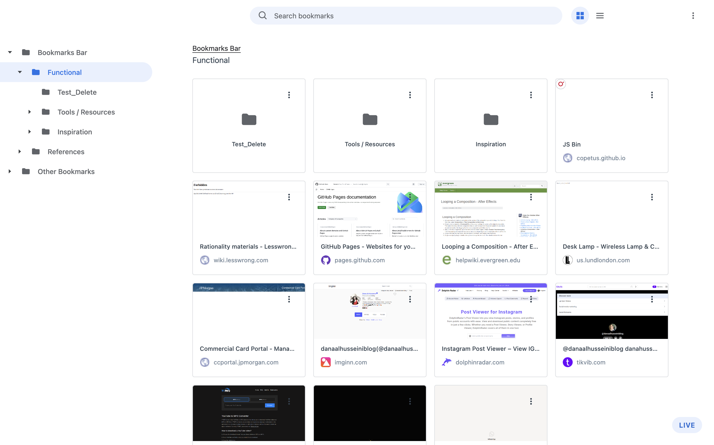

# Gridmarks

Gridmarks is a Chrome extension that reimagines bookmark management with a Google-like visual language and an Opera-inspired grid experience.

It keeps familiar bookmark-manager capabilities such as nested folder navigation, drag and drop, range selection, edit/delete actions, and context menus, while presenting folders and bookmarks in a denser, more visual layout.



## Features

- Collapsible bookmark sidebar with nested folder navigation
- Grid and list view toggle
- Breadcrumb navigation and current-folder header
- Folder cards and bookmark cards in the content area
- Bookmark previews with thumbnail-first fallback styling
- Context menus for bookmarks and folders
- Edit, delete, cut, copy, paste, and open actions
- Drag and drop for moving items into folders and reordering within a folder
- Shift-click bookmark range selection for grouped dragging
- Custom extension icon set

## Install The Extension

### For Non-Technical People

Use these steps if you just want to install the extension and do not normally work with code.

1. Download this project to your computer and unzip it if needed.
2. Open the project folder.
3. Find the folder named `dist`.
4. Open Google Chrome.
5. In the address bar, go to `chrome://extensions`.
6. Turn on `Developer mode` in the top-right corner.
7. Click `Load unpacked`.
8. Choose the `dist` folder from this project.
9. The extension should now appear in Chrome and be ready to use.

If Chrome says the extension is already installed and you made changes later, go back to `chrome://extensions` and click `Reload` on the Gridmarks card.

### For Technical Users

Use these steps if you need to build the extension yourself from source.

1. Clone this repository or download it locally.
2. From the project root, install dependencies:

```bash
npm install
```

3. Build the extension:

```bash
npm run build
```

4. Open `chrome://extensions` in Chrome.
5. Enable `Developer mode`.
6. Click `Load unpacked`.
7. Select the local `dist/` directory.

If you rebuild later, click `Reload` on the extension card in `chrome://extensions`.

## Development

Run the local dev server:

```bash
npm run dev
```

Create a production build:

```bash
npm run build
```

Preview the build locally:

```bash
npm run preview
```

## Project Structure

- `src/`: React UI and interaction logic
- `public/`: extension manifest, background worker, icons, and static assets
- `dist/`: generated unpacked-extension build output

## Notes

- The extension uses the Chrome bookmarks APIs, so it works as its own bookmark-management surface instead of trying to override `chrome://bookmarks`.
- Some actions such as opening bookmarks in incognito windows depend on Chrome extension permissions and local Chrome settings.
